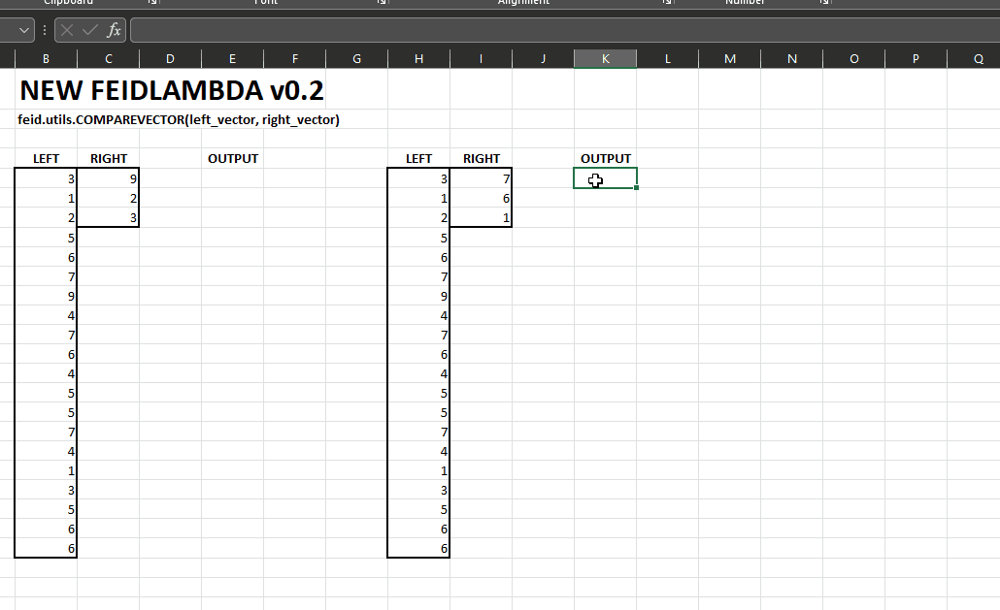
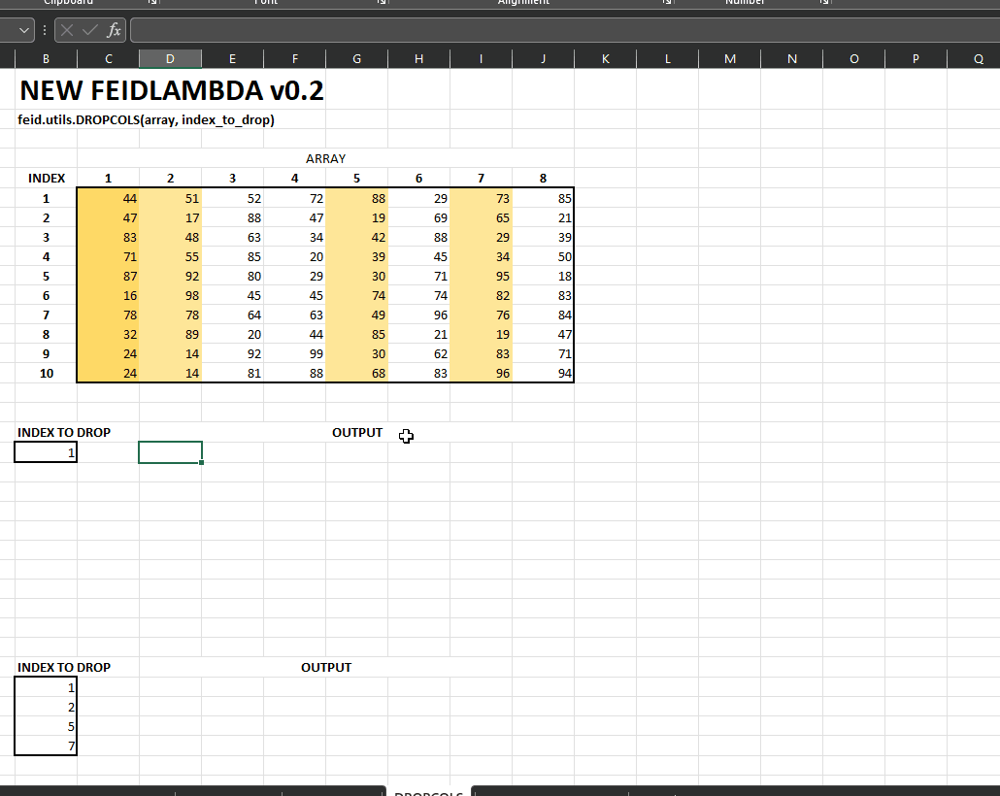

# NEW FUNCTIONS IN FEIDLAMBDA v0.2

NEW FUNCTIONS:
- `feid.utils.COMPAREVECTOR`: Memeriksa apakah setiap elemen di LEFT VECTOR merupakan bagian (_equal_ / `=`)  dari RIGHT VECTOR. Return: BOOLEAN VECTOR.
- `feid.utils.MULTICHECK`: Memeriksa apakah pada setiap kolom _equal_ / `=` dengan SEARCH VECTOR. Dan diproses setiap barisnya menggunakan AND atau OR. Return: BOOLEAN VECTOR. 
- `feid.utils.DROPROWS`: Menghapus baris ke-n dari suatu array. Return: ARRAY. 
- `feid.utils.DROPCOLS`: Menghapus kolom ke-n dari suatu array. Return: ARRAY. 
- `feid.utils.COUNTMULTICHECK`: Menghitung jumlah `TRUE` dari `MULTICHECK`. Return: INTEGER.

## COMPAREVECTOR

```=feid.utils.COMPAREVECTOR(left_vector, right_vector)```



## MULTICHECK

```=feid.utils.MULTICHECK(array, search_vector, [check_condition])```

CATATAN: check_condition diisi "OR" atau "AND", jika tidak diisi dianggap "AND".


## DRPOPROWS

```=feid.utils.DROPROWS(array, index_to_drop)```


## DRPOPCOLS

```=feid.utils.DROPCOLS(array, index_to_drop)```



## COUNTMULTICHECK

```=feid.utils.COUNTMULTICHECK(array, search_vector, [check_condition])```

CATATAN: check_condition diisi "OR" atau "AND", jika tidak diisi dianggap "AND".


---

author: @taruma
