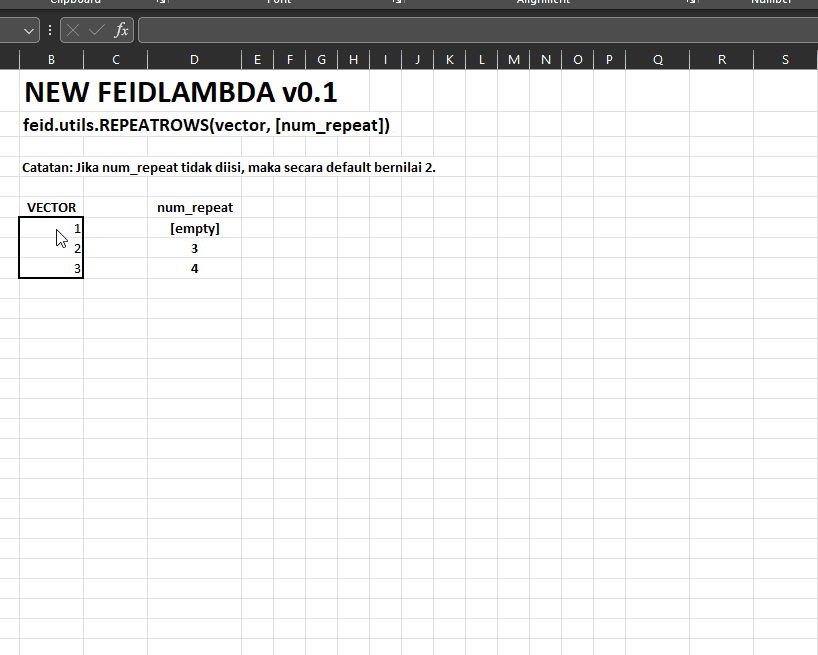
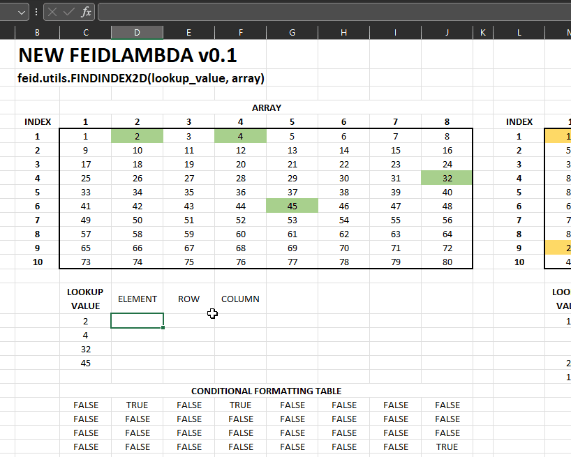

# NEW FUNCTIONS IN FEIDLAMBDA v0.1

FUNCTIONS FEIDLAMBDA v0.1:

- `feid.utils.REPEATCOLS`: Mengulangi _vector_ sebanyak _n_ dalam bentuk kolom. RETURN: COLUMN VECTOR.
- `feid.utils.SORTCOLS`: Menyusun ulang setiap kolom, berdasarkan _header_ yang diurutkan. RETURN: ARRAY.
- `feid.utils.REPEATROWS`: Serupa dengan `.REPEATCOLS`, mengulangi _vector_ sebanyak _n_ dalam bentuk baris. RETURN: ROW VECTOR.
- `feid.utils.RESHAPECOLS`: Mengubah dimensi array dari dimensi _rows x columns_, menjadi _rows x nsplit_ tanpa mengubah susunan baris array. RETURN: ARRAY.
- `feid.utils.FINDINDEX2D`: Mencari index suatu elemen dari _array_ dengan keluaran berupa urutan elemennya, posisi baris dan kolom. RETURN: ARRAY / ROW VECTOR with {number element; index row; index column}.


## REPEATCOLS

```=feid.utils.REPEATCOLS(vector, [num_repeat])```

Catatan: Jika `num_repeat` tidak diisi, maka secara _default_ bernilai 2.


## SORTCOLS

```=feid.utils.SORTCOLS(table, table_header)```

Catatan: Jika input table sebagai array, maka pastikan memisahkan antara header array dan isinya.


## REPEATROWS

```=feid.utils.REPEATROWS(vector, [num_repeat])```

Catatan: Jika `num_repeat` tidak diisi, maka secara _default_ bernilai 2.



## RESHAPECOLS

```=feid.utils.RESHAPECOLS(array, [nsplit])```

Catatan: Jika `nsplit` tidak diisi, maka _default_ bernilai 2.


## FINDINDEX2D

```=feid.utils.FINDINDEX2D(lookup_value, array)```



---

author: @taruma
